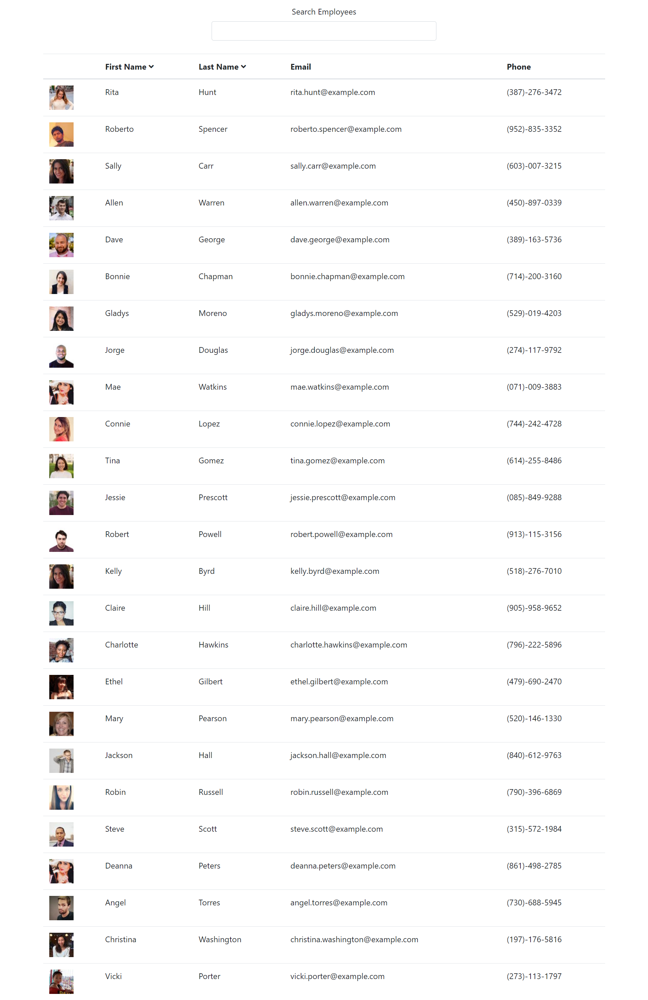

# Employee Directory

  

  ## Table of Contents

  * [Description](#description)

  * [Screenshots](#screenshots)

  * [Installation](#installation)

  * [Tests](#tests)

  * [Usage](#usage)
  * [Contributing](#contributing)

  * [Technologies](#technologies)

  * [Questions](#questions)

  * [License](#license)

  
--------------------------------------

  ## Description:

  This application was created using react and allows the user to search through an employee directory. As the user types in the first or last name, email, or phone number of an employee the application will dynamically shorten the list of employees to only those that meet the search parameters. Users can also order employees alphabetically by either first or last name by clicking the carrots in the table heading.

  
--------------------------------------

  ## Screenshots:

  [Deployed Site](https://ejsmith13.github.io/employee-dir/)

  

  

  
--------------------------------------

  ## Installation

  To install the necessary dependencies use the following command:
  
      npm i
  
  
--------------------------------------

  ## Tests

  To run tests use the following command:
  
      npm run test
  
  
--------------------------------------

  ## Usage:

  Feel free to use this codebase in your own projects

  
--------------------------------------

  ## Contributing:

  Contributions are always welcome! Please use github's best practices when contributing.

  
--------------------------------------

 
  ## Technologies Used
  For this project I used:

  React, HTML, CSS, JavaScript, Bootstrap, NodeJS

  
  
--------------------------------------

  ## Questions

  My name is Ethan Smith if you have questions about this project, please visit my github account (linked below) or feel free to send me an email.

  GitHub account: https://github.com/ejsmith13

  Email: ejsmithwork@gmail.com

  
--------------------------------------

  ## License

  https://opensource.org/licenses/MIT

  Copyright (c) 2021 Ethan Smith

      Permission is hereby granted, free of charge, to any person obtaining a copy
      of this software and associated documentation files (the "Software"), to deal
      in the Software without restriction, including without limitation the rights
      to use, copy, modify, merge, publish, distribute, sublicense, and/or sell
      copies of the Software, and to permit persons to whom the Software is
      furnished to do so, subject to the following conditions:
      
      The above copyright notice and this permission notice shall be included in all
      copies or substantial portions of the Software.
      
      THE SOFTWARE IS PROVIDED "AS IS", WITHOUT WARRANTY OF ANY KIND, EXPRESS OR
      IMPLIED, INCLUDING BUT NOT LIMITED TO THE WARRANTIES OF MERCHANTABILITY,
      FITNESS FOR A PARTICULAR PURPOSE AND NONINFRINGEMENT. IN NO EVENT SHALL THE
      AUTHORS OR COPYRIGHT HOLDERS BE LIABLE FOR ANY CLAIM, DAMAGES OR OTHER
      LIABILITY, WHETHER IN AN ACTION OF CONTRACT, TORT OR OTHERWISE, ARISING FROM,
      OUT OF OR IN CONNECTION WITH THE SOFTWARE OR THE USE OR OTHER DEALINGS IN THE
      SOFTWARE.
